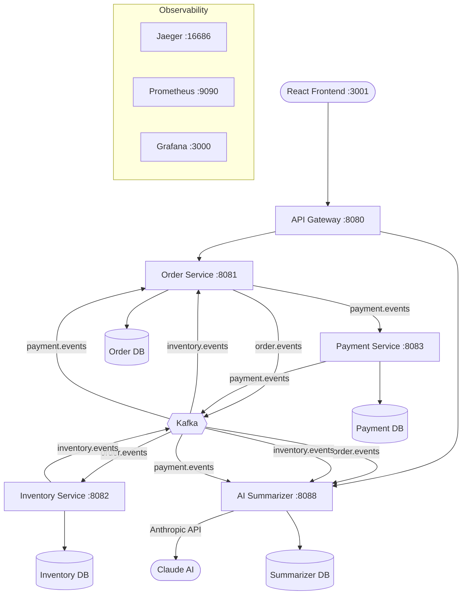

# PulseMart Distributed System

A microservices-based e-commerce order processing system demonstrating the **Saga pattern**, **event-driven architecture**, **JWT authentication**, and **full observability stack** with an AI-powered order summarizer and a React frontend.

## Architecture



## Services

### Backend (Java / Spring Boot)

| Service | Port | Description |
|---------|------|-------------|
| **API Gateway** | 8080 | Spring Cloud Gateway — single entry point, JWT OAuth2 Resource Server |
| **Order Service** | 8081 | Saga coordinator — creates orders, drives state transitions |
| **Inventory Service** | 8082 | Reserves/releases inventory based on saga events |
| **Payment Service** | 8083 | Processes payments (configurable 30% failure rate for demo) |
| **AI Summarizer** | 8088 | Listens to all saga events, generates AI summaries on completion |

### Frontend (React / Vite)

| App | Port | Description |
|-----|------|-------------|
| **React SPA** | 3001 (nginx) / 5173 (dev) | Login, place orders, track saga progress, view AI summaries |

## Tech Stack

### Backend
- **Java 17** + **Spring Boot 3.2.5**
- **Spring Cloud Gateway** (API routing + JWT auth)
- **Spring Security OAuth2 Resource Server** (RSA asymmetric JWT)
- **Apache Kafka** (KRaft mode, event streaming)
- **PostgreSQL 16** (per-service databases)
- **Redis 7** (idempotency pre-check)
- **Flyway** (database migrations)
- **OpenTelemetry** (distributed tracing via Java agent + Micrometer bridge)
- **Prometheus + Grafana** (metrics & dashboards)
- **Jaeger** (trace visualization)
- **Anthropic Claude API** (AI order summarization)

### Frontend
- **React 18** + **Vite**
- **React Router** (SPA routing)
- **Axios** (HTTP client with JWT interceptor)
- **Nginx** (production serving)

### Testing
- **JUnit 5** + **Mockito** (unit tests)
- **TestContainers** (full saga E2E tests with Docker Compose)
- **WireMock** (Anthropic API mocking in E2E)
- **Awaitility** (async saga polling)

## Quick Start

### Prerequisites

- Java 17+
- Node.js 20+ (for frontend development)
- Docker & Docker Compose
- Anthropic API key (for AI summarizer)

### Build & Run

```bash
# Build all backend service JARs
cd backend
./gradlew bootJar

# Start everything (infra + backend + frontend)
cd ../infra
ANTHROPIC_API_KEY=your-key-here docker compose up -d
```

All services will be available once healthy:
- **Frontend**: http://localhost:3001
- **API Gateway**: http://localhost:8080

### Frontend Development

```bash
cd frontend
npm install
npm run dev    # Vite dev server at http://localhost:5173
```

## Authentication

The API Gateway uses **JWT OAuth2 Resource Server** with RSA asymmetric keys.

```bash
# 1. Get a JWT token (demo — no credential validation)
curl -X POST http://localhost:8080/auth/token \
  -H "Content-Type: application/json" \
  -d '{"userId":"user-001","customerId":"cust-001"}'

# 2. Use the token for protected endpoints
curl http://localhost:8080/orders \
  -H "Authorization: Bearer <token>"

# 3. Public endpoints (no token required)
curl http://localhost:8080/summaries
curl http://localhost:8080/actuator/health
```

**Route security**:
| Endpoint | Auth Required |
|----------|:---:|
| `POST /auth/token` | No |
| `GET /actuator/**` | No |
| `GET /summaries/**` | No |
| `GET /orders/**` | Yes |
| `POST /orders/**` | Yes |

## API Endpoints (via Gateway)

```bash
# Place an order
curl -X POST http://localhost:8080/orders \
  -H "Content-Type: application/json" \
  -H "Authorization: Bearer <token>" \
  -d '{
    "customerId": "cust-001",
    "items": [
      { "productId": "prod-001", "productName": "Widget", "quantity": 2, "unitPrice": 29.99 }
    ]
  }'

# Get order by ID
curl http://localhost:8080/orders/{orderId} -H "Authorization: Bearer <token>"

# Get all orders for a customer
curl "http://localhost:8080/orders?customerId=cust-001" -H "Authorization: Bearer <token>"

# Get AI summary for an order (public)
curl http://localhost:8080/summaries/{orderId}

# Get all summaries (public)
curl http://localhost:8080/summaries
```

## Saga Flow

### Happy Path

```
Order Created → Inventory Reserved → Payment Succeeded → Order Completed
```

1. **Order Service** creates the order and publishes `ORDER_CREATED`
2. **Inventory Service** reserves stock, publishes `INVENTORY_RESERVED`
3. **Order Service** receives reservation, publishes `PAYMENT_INITIATED`
4. **Payment Service** processes payment, publishes `PAYMENT_SUCCEEDED`
5. **Order Service** marks order as `COMPLETED`, publishes `ORDER_COMPLETED`
6. **AI Summarizer** generates a summary of the full saga

### Compensation (Payment Failure)

```
Order Created → Inventory Reserved → Payment Failed → Inventory Released → Order Cancelled
```

1. Steps 1-3 same as above
2. **Payment Service** fails (30% rate), publishes `PAYMENT_FAILED`
3. **Order Service** triggers compensation, publishes `ORDER_CANCELLED`
4. **Inventory Service** releases reserved stock, publishes `INVENTORY_RELEASED`
5. **AI Summarizer** generates a summary of the failed saga

### Key Patterns

- **Outbox Pattern**: Order write + outbox event write in a single `@Transactional`. `OutboxPublisher` polls with `SKIP LOCKED` every 1s.
- **Idempotency**: `processed_events` table with `ON CONFLICT DO NOTHING`. Redis is a performance pre-check only.

## Kafka Topics

| Topic | Producer | Consumers |
|-------|----------|-----------|
| `order.events` | Order Service | Inventory Service, AI Summarizer |
| `inventory.events` | Inventory Service | Order Service, AI Summarizer |
| `payment.events` | Payment Service | Order Service, AI Summarizer |

All topics: 3 partitions, 7-day retention.

## E2E Tests

Full saga end-to-end tests using TestContainers Docker Compose + WireMock (to mock the Anthropic API).

```bash
# Build all service JARs first
cd backend
./gradlew bootJar

# Run E2E tests (requires Docker)
./gradlew :e2e-tests:test -Pe2e
```

Tests spin up the entire stack (Kafka, PostgreSQL, Redis, all services, WireMock) and verify:
- **Happy path**: Place order → poll until COMPLETED → verify AI summary exists
- **Compensation**: Place order with 100% payment failure → poll until CANCELLED
- **Auth**: Unauthenticated requests return 401, public endpoints return 200

## Observability

| Tool | URL | Purpose |
|------|-----|---------|
| **Grafana** | http://localhost:3000 | Dashboards (admin/admin) |
| **Jaeger** | http://localhost:16686 | Distributed traces |
| **Prometheus** | http://localhost:9090 | Metrics & alerting |

All services export traces via OpenTelemetry (Java agent + Micrometer bridge) and metrics via Prometheus actuator endpoints.

## Project Structure

```
pulsemart-distributed-system/
├── backend/                 # Java / Spring Boot monorepo (Gradle)
│   ├── api-gateway/         # Spring Cloud Gateway + JWT auth (port 8080)
│   ├── order-service/       # Saga coordinator (port 8081)
│   ├── inventory-service/   # Inventory management (port 8082)
│   ├── payment-service/     # Payment processing (port 8083)
│   ├── ai-summarizer/       # AI-powered order summarization (port 8088)
│   ├── shared-lib/          # Event envelopes, types, and payloads
│   ├── e2e-tests/           # Full saga E2E tests (TestContainers + WireMock)
│   ├── build.gradle         # Root Gradle build
│   └── settings.gradle      # Module includes
├── frontend/                # React + Vite SPA
│   ├── src/
│   │   ├── api/             # Axios client with JWT interceptor
│   │   ├── components/      # Navbar, ProtectedRoute
│   │   ├── context/         # AuthContext (JWT state)
│   │   └── pages/           # Login, PlaceOrder, OrdersList, OrderDetail
│   ├── Dockerfile           # Multi-stage: node build → nginx serve
│   └── nginx.conf           # SPA fallback, port 3001
└── infra/
    ├── docker-compose.yml
    ├── kafka/               # Topic initialization script
    ├── prometheus/           # Prometheus config
    └── grafana/             # Datasources & dashboards
```

## Environment Variables

| Variable | Service | Default | Description |
|----------|---------|---------|-------------|
| `ANTHROPIC_API_KEY` | ai-summarizer | — | Anthropic API key (required) |
| `ANTHROPIC_MODEL` | ai-summarizer | `claude-haiku-4-5-20251001` | Claude model to use |
| `PAYMENT_FAILURE_RATE` | payment-service | `0.3` | Simulated payment failure rate |
| `ORDER_SERVICE_URL` | api-gateway | `http://localhost:8081` | Order service URL |
| `AI_SUMMARIZER_URL` | api-gateway, order-service | `http://localhost:8088` | AI summarizer URL |
| `VITE_API_URL` | frontend | `http://localhost:8080` | API Gateway URL (frontend) |
