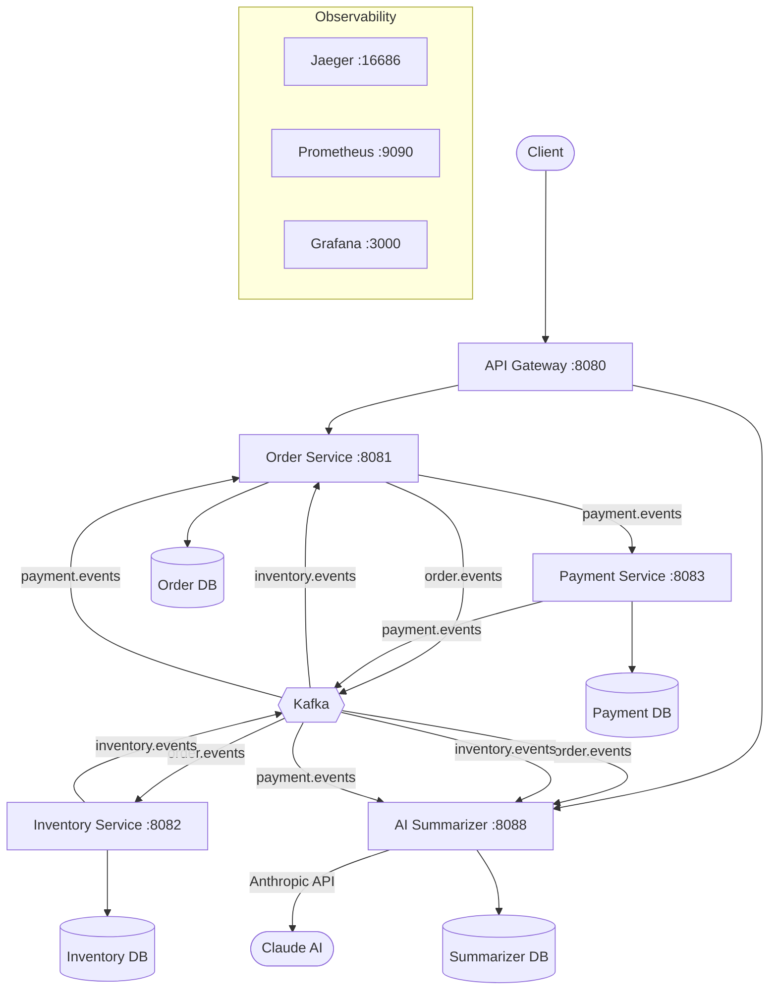

# PulseMart Distributed System

A microservices-based e-commerce order processing system demonstrating the **Saga pattern**, **event-driven architecture**, and **full observability stack** with an AI-powered order summarizer.

## Architecture



## Services

| Service | Port | Description |
|---------|------|-------------|
| **API Gateway** | 8080 | Spring Cloud Gateway — single entry point, routes to downstream services |
| **Order Service** | 8081 | Saga coordinator — creates orders, drives state transitions |
| **Inventory Service** | 8082 | Reserves/releases inventory based on saga events |
| **Payment Service** | 8083 | Processes payments (configurable 30% failure rate for demo) |
| **AI Summarizer** | 8088 | Listens to all saga events, generates AI summaries on completion |

## Tech Stack

- **Java 17** + **Spring Boot 3.2.5**
- **Spring Cloud Gateway** (API routing)
- **Apache Kafka** (KRaft mode, event streaming)
- **PostgreSQL 16** (per-service databases)
- **Redis 7** (idempotency pre-check)
- **Flyway** (database migrations)
- **OpenTelemetry** (distributed tracing via Java agent + Micrometer bridge)
- **Prometheus + Grafana** (metrics & dashboards)
- **Jaeger** (trace visualization)
- **Anthropic Claude API** (AI order summarization)

## Quick Start

### Prerequisites

- Java 17+
- Docker & Docker Compose
- Anthropic API key (for AI summarizer)

### Build & Run

```bash
# Build all service JARs
./gradlew bootJar

# Start everything (infra + services)
cd infra
ANTHROPIC_API_KEY=your-key-here docker compose up -d
```

All services will be available once healthy. The API Gateway on **http://localhost:8080** is the single entry point.

### API Endpoints (via Gateway)

```bash
# Place an order
curl -X POST http://localhost:8080/orders \
  -H "Content-Type: application/json" \
  -d '{
    "customerId": "cust-001",
    "items": [
      { "productId": "prod-001", "productName": "Widget", "quantity": 2, "unitPrice": 29.99 }
    ]
  }'

# Get order by ID
curl http://localhost:8080/orders/{orderId}

# Get all orders
curl http://localhost:8080/orders

# Get AI summary for an order
curl http://localhost:8080/summaries/{orderId}

# Get all summaries
curl http://localhost:8080/summaries
```

## Saga Flow

### Happy Path

```
Order Created → Inventory Reserved → Payment Succeeded → Order Completed
```

1. **Order Service** creates the order and publishes `ORDER_CREATED`
2. **Inventory Service** reserves stock, publishes `INVENTORY_RESERVED`
3. **Order Service** receives reservation, publishes `PAYMENT_INITIATED`
4. **Payment Service** processes payment, publishes `PAYMENT_SUCCEEDED`
5. **Order Service** marks order as `COMPLETED`, publishes `ORDER_COMPLETED`
6. **AI Summarizer** generates a summary of the full saga

### Compensation (Payment Failure)

```
Order Created → Inventory Reserved → Payment Failed → Inventory Released → Order Cancelled
```

1. Steps 1-3 same as above
2. **Payment Service** fails (30% rate), publishes `PAYMENT_FAILED`
3. **Order Service** triggers compensation, publishes `ORDER_CANCELLED`
4. **Inventory Service** releases reserved stock, publishes `INVENTORY_RELEASED`
5. **AI Summarizer** generates a summary of the failed saga

### Key Patterns

- **Outbox Pattern**: Order write + outbox event write in a single `@Transactional`. `OutboxPublisher` polls with `SKIP LOCKED` every 1s.
- **Idempotency**: `processed_events` table with `ON CONFLICT DO NOTHING`. Redis is a performance pre-check only.

## Kafka Topics

| Topic | Producer | Consumers |
|-------|----------|-----------|
| `order.events` | Order Service | Inventory Service, AI Summarizer |
| `inventory.events` | Inventory Service | Order Service, AI Summarizer |
| `payment.events` | Payment Service | Order Service, AI Summarizer |

All topics: 3 partitions, 7-day retention.

## Observability

| Tool | URL | Purpose |
|------|-----|---------|
| **Grafana** | http://localhost:3000 | Dashboards (admin/admin) |
| **Jaeger** | http://localhost:16686 | Distributed traces |
| **Prometheus** | http://localhost:9090 | Metrics & alerting |

All services export traces via OpenTelemetry (Java agent + Micrometer bridge) and metrics via Prometheus actuator endpoints.

## Project Structure

```
pulsemart-distributed-system/
├── shared-lib/          # Event envelopes, types, and payloads
├── api-gateway/         # Spring Cloud Gateway (port 8080)
├── order-service/       # Saga coordinator (port 8081)
├── inventory-service/   # Inventory management (port 8082)
├── payment-service/     # Payment processing (port 8083)
├── ai-summarizer/       # AI-powered order summarization (port 8088)
└── infra/
    ├── docker-compose.yml
    ├── kafka/           # Topic initialization script
    ├── prometheus/       # Prometheus config
    └── grafana/         # Datasources & dashboards
```

## Environment Variables

| Variable | Service | Default | Description |
|----------|---------|---------|-------------|
| `ANTHROPIC_API_KEY` | ai-summarizer | — | Anthropic API key (required) |
| `ANTHROPIC_MODEL` | ai-summarizer | `claude-haiku-4-5-20251001` | Claude model to use |
| `PAYMENT_FAILURE_RATE` | payment-service | `0.3` | Simulated payment failure rate |
| `ORDER_SERVICE_URL` | api-gateway | `http://localhost:8081` | Order service URL |
| `AI_SUMMARIZER_URL` | api-gateway, order-service | `http://localhost:8088` | AI summarizer URL |
